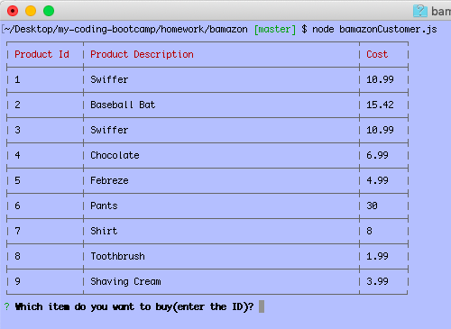

# bamazon
Overview: This application is a command line amazon-like application which uses mysql, inquirer and table npm packages & allows for the following functionality:

1. When you run the program you will see a table of Product Ids, Product Descriptions and Prices

      
2. The user is prompted to enter an item id
3. The program then checks to see if the ID entered is valid by logging into the mySQL database and determining if that item exists
 - If it doesn't exist the user is prompted to enter valid ID

4. If the item id exists, the user is then prompted to enter a quantity
5. The program then checks to ensure the quantity requested by the user does not exceed the total amount on hand
- If there is insufficient quantity the user is notified and asked to enter a lower quantity

If the quantity requested is less than or equal to the amount on hand for that item,  the program then will:
- Decrement the inventory on hand in the mySQL database
- Confirm to the user that their order was fulfilled
- Display to the user the total cost for their order

To run this program please do the following:
1. Run the file Setup.sql in your mySQL database to create the required DB objects.  Confirm that you have done this correctly with the included select statement
2. You will need to run npm install for mysql, inquirer and table from the command line in your terminal before running the application
3. From the command line run the program by typing "node bamazonCustomer.js"
4. Select an item by id
5. Select a quantity
6. You can test whether the application logic is working by
- entering an invalid item id at the prompt
- attempting to order a very large number that exceeds the on hand stored in the database
- confirm the onhand by running a SQL query i.e. select stock_quantity from products where item_id = your item id in mySQL then enter a smaller number then is returned

This application must be run in the terminal so no URL is provided.

